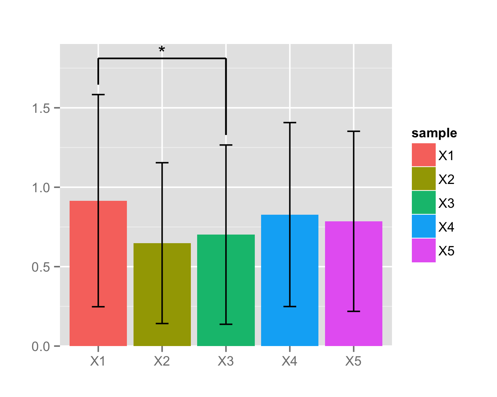

#  yplots: Yu's plot utilities

## DEMO ##
### barplot ###
```
 df <- data.frame(Normal=c(0.83,0.79,0.99,0.69), Cancer=c(0.56,0.56,0.64,0.52))
barplot(df, barIndex=c(1,2), label="*") + theme_bw(base_size=16)
```

## Authors ##

Guangchuang YU, School of Public Health, The University of Hong Kong [http://ygc.name](http://ygc.name)

## License ##

All source code is copyright, under the Artistic-2.0 License.
For more information on Artistic-2.0 License see [http://opensource.org/licenses/Artistic-2.0](http://opensource.org/licenses/Artistic-2.0)

## Installation ##

To install:
 * the latest development version:
   `install_github("GuangchuangYu/yplots")`

## Bugs/Feature requests ##

 - If you have any, [let me know](https://github.com/GuangchuangYu/yplots/issues). Thx!


